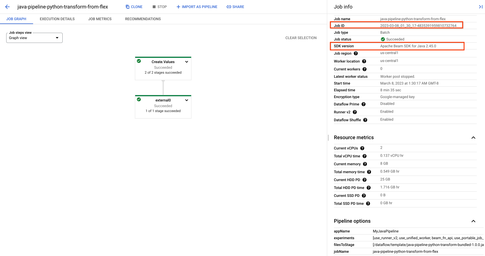
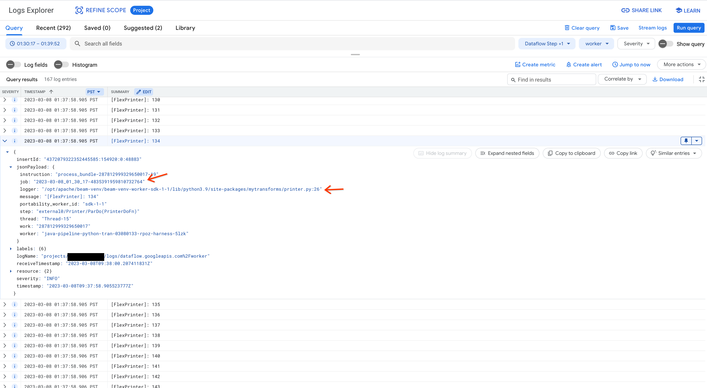

Java Pipeline with Python transform
----

Dataflow Java sample pipeline using custom Python external transform.

This project consists of Java pipeline and Python
transform. [MyJavaPipeline](java/src/main/java/baeminbo/MyJavaPipeline.java) in
Java gets `[100, ... 200)` as input, and print the element in
the [Printer](python/mytransforms/printer.py) transform in Python.

### Run Pipeline

Run [run_pipeline.sh](run_pipeline.sh). It builds the Python
package `mytransforms-1.0.0.tar.gz`, and set it
as `PythonExternalTransform.withExtraPackages()`. The extra packages are used
for running expansion service, and also staged to GCS so that Python SDK harness
container downloads them to execute the custom transform.

### Run Pipeline from Flex Template

Run [create_flex_template.sh](create_flex_template.sh) to build a Flex template
docker container image with [Dockerfile](Dockerfile). The flex template image is
uploaded
to `us-central1-docker.pkg.dev/$PROJECT/dataflow/flex/java-pipeline-python-transform`
. The Datafow flex template file is created
at `gs://$PROJECT/dataflow/flex/java-pipeline-python-transform` by default. 

Run [run_flex_template.sh](run_flex_template.sh) to run the created flex template. 

If everything goes well, you may see the job is in Java and the Python `Printer` transform outputs logs.   

